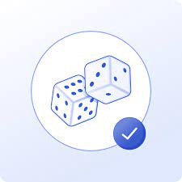

<p align="center">  </p>
</br>

# Lottery using Chainlink VRF V2(Verifiable Random Function)

<p>A simple lottery in the blockchain in which the winner is chosen with provable randomness using Chainlink VRF V2 and automation from Chainlink Keepers</p>

# Getting Started

## Requirements

-   [git](https://git-scm.com/book/en/v2/Getting-Started-Installing-Git)

    -   You'll know you did it right if you can run `git --version` and you see a response like `git version x.x.x`

-   [Nodejs](https://nodejs.org/en/)
    -   You'll know you've installed nodejs right if you can run:
        -   `node --version` and get an ouput like: `vx.x.x`

## Quickstart

```bash
git clone https://github.com/KumaCrypto/Raffle-fcc
```

---

```bash
cd Raffle-fcc
```

---

```bash
npm install --save-dev
```
